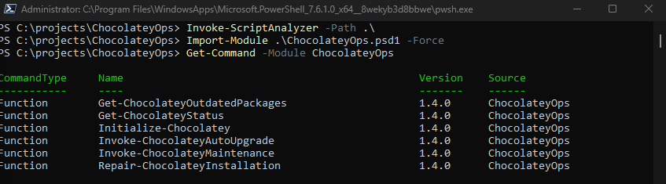
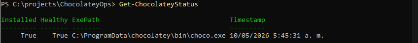
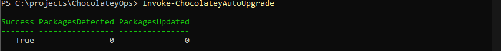

# ChocolateyOps

Production-ready PowerShell module for automated Chocolatey lifecycle management, unattended upgrades, runtime validation, and self-healing remediation.

---

## Features

- Automatic Chocolatey bootstrap
- Runtime health validation
- Self-healing remediation
- Automatic package upgrades
- Outdated package detection
- Corrupted runtime recovery
- Idempotent execution
- PowerShell 5.1 / 7 support
- Enterprise-ready automation

---

## Project Structure

```text
ChocolateyOps/
│
├── Private/
│   ├── ChocolateyOps.Internal.ps1
│   └── ChocolateyOps.Logging.ps1
│
├── Public/
│   ├── Ensure-Chocolatey.ps1
│   ├── Get-ChocolateyOutdatedPackages.ps1
│   ├── Get-ChocolateyStatus.ps1
│   ├── Initialize-Chocolatey.ps1
│   ├── Install-ChocolateyPackage.ps1
│   ├── Invoke-ChocolateyAutoUpgrade.ps1
│   ├── Invoke-ChocolateyMaintenance.ps1
│   ├── Remove-ChocolateyPackage.ps1
│   ├── Repair-ChocolateyInstallation.ps1
│   ├── Update-Chocolatey.ps1
│   └── Update-ChocolateyPackage.ps1
│
├── Tests/
│   └── ChocolateyOps.Tests.ps1
│
├── .gitignore
├── ChocolateyOps.psd1
├── ChocolateyOps.psm1
└── README.md
```

---

## Requirements

| Component | Version |
| --- | --- |
| Windows | 10 / 11 / Server |
| PowerShell | 5.1+ |
| Chocolatey | Optional |
| Administrator Rights | Recommended |

---

## Installation

### Clone Repository

```powershell
git clone https://github.com/omaciasd/ChocolateyOps.git

cd ChocolateyOps
```

---

### Import Module



---

## Exported Commands

| Command | Description |
| --- | --- |
| Ensure-Chocolatey | Ensures Chocolatey installation |
| Get-ChocolateyOutdatedPackages | Lists outdated packages |
| Get-ChocolateyStatus | Returns Chocolatey runtime health |
| Initialize-Chocolatey | Bootstraps Chocolatey |
| Install-ChocolateyPackage | Installs packages |
| Invoke-ChocolateyAutoUpgrade | Performs unattended upgrades |
| Invoke-ChocolateyMaintenance | Executes maintenance workflow |
| Remove-ChocolateyPackage | Removes packages |
| Repair-ChocolateyInstallation | Repairs corrupted runtime |
| Update-Chocolatey | Updates Chocolatey |
| Update-ChocolateyPackage | Updates individual packages |

---

## Usage

### Validate Runtime



---

### Detect Outdated Packages


---

### Automatic Package Upgrade



---

### Full Maintenance Workflow

```powershell
Invoke-ChocolateyMaintenance
```

---

### Repair Corrupted Runtime

```powershell
Repair-ChocolateyInstallation
```

---

## Self-Healing Validation

### Simulate Runtime Corruption

```powershell
Rename-Item `
    C:\ProgramData\chocolatey\bin\choco.exe `
    choco.exe.bak
```

---

### Run Recovery Workflow

```powershell
Invoke-ChocolateyAutoUpgrade `
    -RepairIfUnhealthy `
    -Verbose
```

Expected:

```text
[INFO] Starting Chocolatey remediation...
[INFO] Backing up corrupted installation...
[INFO] Removing corrupted installation...
[INFO] Reinstalling Chocolatey...
[INFO] Chocolatey restored successfully.
```

---

## Validation

### Validate Manifest

```powershell
Test-ModuleManifest .\ChocolateyOps.psd1
```

---

### Static Analysis

Install analyzer:

```powershell
Install-Module PSScriptAnalyzer `
    -Scope CurrentUser `
    -Force
```

Run analyzer:

```powershell
Invoke-ScriptAnalyzer -Path .\
```

Expected:

```text
No findings.
```

---

### Pester Tests

Install:

```powershell
Install-Module Pester `
    -Scope CurrentUser `
    -Force
```

Run:

```powershell
Invoke-Pester
```

---

## PowerShell Compatibility

|Version | Status |
| --- | --- |
| Windows PowerShell 5.1 | Supported |
| PowerShell 7.x | Supported |

---

## Operational Design

Designed for:

- Enterprise endpoints
- DevOps workstations
- CI/CD runners
- Automated maintenance jobs
- Self-healing automation
- Unattended package lifecycle management

---

## Security Notes

- Administrative privileges recommended
- Remediation performs filesystem operations
- Uses official Chocolatey installation sources
- Idempotent operations reduce operational risk

---

## Scheduled Automation Example

```powershell
pwsh `
  -ExecutionPolicy Bypass `
  -Command "Import-Module C:\Modules\ChocolateyOps\ChocolateyOps.psd1; Invoke-ChocolateyMaintenance"
```

---

## GitHub Actions CI Example

```yaml
name: ChocolateyOps-CI

on:
  push:
  pull_request:

jobs:

  validate:

    runs-on: windows-latest

    steps:

    - name: Checkout
      uses: actions/checkout@v4

    - name: Install Dependencies
      shell: pwsh
      run: |
        Install-Module Pester -Force -Scope CurrentUser
        Install-Module PSScriptAnalyzer -Force -Scope CurrentUser

    - name: Validate Manifest
      shell: pwsh
      run: |
        Test-ModuleManifest .\ChocolateyOps.psd1

    - name: Run Script Analyzer
      shell: pwsh
      run: |
        Invoke-ScriptAnalyzer -Path .\ -Recurse

    - name: Run Pester
      shell: pwsh
      run: |
        Invoke-Pester
```

---

## Roadmap

Planned enhancements:

- Structured JSON logging
- ELK / Grafana integration
- Retry orchestration engine
- Policy engine
- Offline repository support
- Package governance
- Windows Event Log integration

---

## License

MIT License

---

## Contributing

1. Fork repository
2. Create feature branch
3. Add tests
4. Run validation
5. Submit pull request

---

## Operational Status

Validated capabilities:

- Module import
- Runtime validation
- Package upgrade automation
- Corrupted runtime remediation
- Self-healing recovery
- Idempotent execution
- PowerShell 7 compatibility
- Static analysis validation
